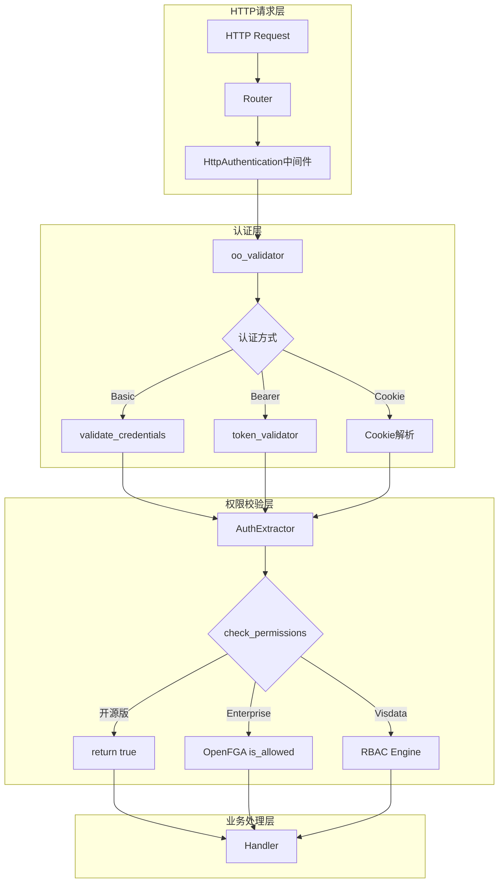
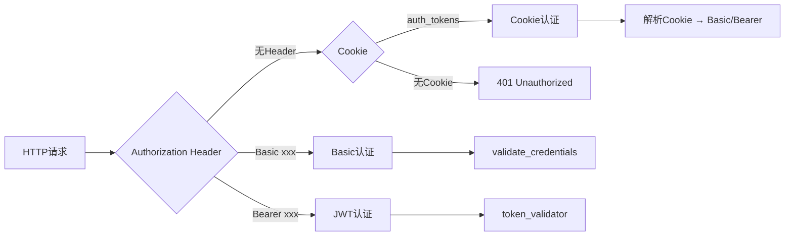
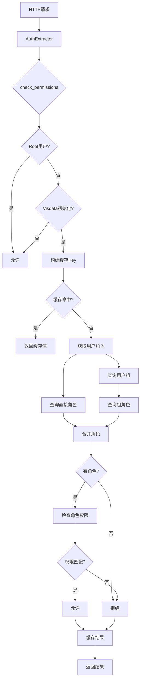

# OpenObserve 认证与权限管理系统详解

本文档详细分析OpenObserve三个版本（开源版、Enterprise版、Visdata版）的登录认证、角色权限管理、权限校验和数据权限过滤的实现逻辑和核心代码。

---

## 目录

- [第一章：系统架构概览](#第一章系统架构概览)
- [第二章：登录认证系统](#第二章登录认证系统)
- [第三章：角色权限管理 - 三版本对比](#第三章角色权限管理---三版本对比)
- [第四章：权限校验机制 - 三版本对比](#第四章权限校验机制---三版本对比)
- [第五章：数据权限过滤 - 三版本对比](#第五章数据权限过滤---三版本对比)
- [第六章：缓存机制](#第六章缓存机制)
- [第七章：前端集成](#第七章前端集成)
- [第八章：安全特性总结](#第八章安全特性总结)
- [第九章：Visdata方案实施 - 开源代码修改清单](#第九章visdata方案实施---开源代码修改清单)

---

## 第一章：系统架构概览

### 1.1 三个版本对比总览

| 功能特性 | 开源版 | Enterprise版 | Visdata版 |
|---------|--------|-------------|-----------|
| **权限检查** | 始终允许（无检查） | OpenFGA细粒度控制 | Visdata RBAC引擎 |
| **支持角色数** | 3个（Root/Admin/ServiceAccount） | 6个 + 自定义角色 | 6个 + 自定义角色 |
| **自定义角色** | 不支持 | 支持 | 支持 |
| **用户组** | 不支持 | 支持 | 支持 |
| **权限继承** | 无 | OpenFGA Tuple关系 | 组→角色→权限 |
| **数据过滤** | 仅组织级 | 资源级+对象级 | 资源级+对象级 |
| **审计日志** | 无 | 有 | 有 |
| **条件编译** | `#[cfg(all(not(enterprise), not(visdata)))]` | `#[cfg(feature = "enterprise")]` | `#[cfg(feature = "visdata")]` |

### 1.2 核心组件架构图



### 1.3 关键代码文件索引

| 功能模块 | 文件路径 |
|----------|----------|
| 认证验证核心 | `src/handler/http/auth/validator.rs` |
| 权限提取器 | `src/common/utils/auth.rs` |
| 用户角色定义 | `src/config/src/meta/user.rs` |
| JWT处理 | `src/common/utils/jwt.rs` |
| Token验证 | `src/handler/http/auth/token.rs` |
| 路由定义 | `src/handler/http/router/mod.rs` |
| 用户登录端点 | `src/handler/http/request/users/mod.rs` |
| OpenFGA初始化 | `src/common/infra/ofga/mod.rs` |
| OpenFGA角色API | `src/handler/http/request/authz/fga.rs` |
| Visdata RBAC引擎 | `crates/visdata/src/rbac/engine.rs` |
| Visdata缓存 | `crates/visdata/src/rbac/cache.rs` |
| 前端IAM服务 | `web/src/services/iam.ts` |

---

## 第二章：登录认证系统

> 登录认证系统在三个版本中基本通用，Enterprise版额外支持OAuth2/Dex集成。

### 2.1 认证入口点和API路由

#### 2.1.1 路由定义

**文件**: `src/handler/http/router/mod.rs` (第258-263行)

```rust
svc.service(
    web::scope("/auth")
        .wrap(cors.clone())
        .service(users::authentication)      // POST /auth/login
        .service(users::get_presigned_url)   // GET /auth/presigned-url
        .service(users::get_auth),           // GET /auth/login
);
```

#### 2.1.2 登录端点实现

**文件**: `src/handler/http/request/users/mod.rs` (第365-442行)

```rust
#[post("/login")]
pub async fn authentication(
    auth: Option<web::Json<SignInUser>>,
    _req: HttpRequest,
) -> Result<HttpResponse, Error> {
    // 1. 检查原生登录是否启用（Enterprise版可能禁用）
    #[cfg(feature = "enterprise")]
    let native_login_enabled = get_dex_config().native_login_enabled;
    #[cfg(not(feature = "enterprise"))]
    let native_login_enabled = true;

    if !native_login_enabled {
        return Ok(HttpResponse::Forbidden().json("Not Supported"));
    }

    // 2. 提取登录凭证
    let auth = match auth {
        Some(auth) => auth.into_inner(),
        None => return Ok(HttpResponse::BadRequest().json("Missing credentials")),
    };

    // 3. 验证用户
    let resp = match crate::service::users::validate_user(&auth.name, &auth.password).await {
        Ok(resp) => resp,
        Err(e) => return Ok(HttpResponse::InternalServerError().json(e.to_string())),
    };

    // 4. 返回认证结果和Cookie
    if resp.status {
        let cfg = get_config();

        // 生成认证Token
        let access_token = format!(
            "Basic {}",
            base64::encode(&format!("{}:{}", auth.name, auth.password))
        );

        let tokens = json::to_string(&AuthTokens {
            access_token,
            refresh_token: "".to_string(),
        }).unwrap();

        // 创建安全Cookie
        let mut auth_cookie = cookie::Cookie::new("auth_tokens", base64::encode(&tokens));
        auth_cookie.set_expires(
            cookie::time::OffsetDateTime::now_utc()
                + cookie::time::Duration::seconds(cfg.auth.cookie_max_age),
        );
        auth_cookie.set_http_only(true);      // 防止XSS攻击
        auth_cookie.set_secure(cfg.auth.cookie_secure_only);  // 仅HTTPS
        auth_cookie.set_path("/");

        if cfg.auth.cookie_same_site_lax {
            auth_cookie.set_same_site(cookie::SameSite::Lax);
        } else {
            auth_cookie.set_same_site(cookie::SameSite::None);
        }

        Ok(HttpResponse::Ok().cookie(auth_cookie).json(resp))
    } else {
        Ok(HttpResponse::Unauthorized().json(resp))
    }
}
```

### 2.2 认证流程

#### 2.2.1 支持的认证方式



#### 2.2.2 认证中间件链

**文件**: `src/handler/http/router/mod.rs` (第375-395行)

```rust
pub fn get_service_routes(svc: &mut web::ServiceConfig) {
    let service = web::scope("/api")
        // 1. 组织阻止检查
        .wrap(middleware::from_fn(blocked_orgs_middleware))
        // 2. 审计日志（Enterprise版）
        .wrap(middleware::from_fn(audit_middleware))
        // 3. 认证验证（核心）
        .wrap(HttpAuthentication::with_fn(
            super::auth::validator::oo_validator,
        ))
        // 4. CORS处理
        .wrap(cors.clone())
        // ... API路由注册
}
```

### 2.3 密码验证机制

#### 2.3.1 密码哈希函数

**文件**: `src/common/utils/auth.rs` (第88-99行)

```rust
/// 生成密码哈希（带缓存）
pub(crate) fn get_hash(pass: &str, salt: &str) -> String {
    let key = format!("{pass}{salt}");

    // 检查缓存
    let hash = PASSWORD_HASH.get(&key);
    match hash {
        Some(ret_hash) => ret_hash.value().to_string(),
        None => {
            // 使用bcrypt生成哈希
            let password_hash = get_passcode_hash(pass, salt);
            PASSWORD_HASH.insert(key, password_hash.clone());
            password_hash
        }
    }
}

/// 实际的哈希生成（PBKDF2）
fn get_passcode_hash(pass: &str, salt: &str) -> String {
    use pbkdf2::{pbkdf2_hmac_array, Params};
    use sha2::Sha256;

    let params = Params {
        rounds: 10000,
        output_length: 32,
    };

    let hash = pbkdf2_hmac_array::<Sha256, 32>(
        pass.as_bytes(),
        salt.as_bytes(),
        params.rounds,
    );

    base64::encode(hash)
}
```

#### 2.3.2 凭证验证流程

**文件**: `src/handler/http/auth/validator.rs` (第154-329行)

```rust
pub async fn validate_credentials(
    user_id: &str,
    user_password: &str,
    path: &str,
) -> Result<TokenValidationResponse, Error> {
    // 1. 解析路径获取组织ID
    let mut path_columns = path.split('/').collect::<Vec<&str>>();
    let org_id = if path_columns.len() > 1 && path_columns[0].eq(V2_API_PREFIX) {
        path_columns[1]
    } else {
        path_columns[0]
    };

    // 2. 获取用户（根据是否Root用户决定查询方式）
    let user = if is_root_user(user_id) {
        users::get_user(Some(DEFAULT_ORG), user_id).await
    } else {
        users::get_user(Some(org_id), user_id).await
    };

    let user = match user {
        Some(u) => u,
        None => return Ok(TokenValidationResponse {
            is_valid: false,
            user_email: "".to_string(),
            ..Default::default()
        }),
    };

    // 3. 检查Service Account Token
    if user.role.eq(&UserRole::ServiceAccount) && user.token.eq(&user_password) {
        return Ok(TokenValidationResponse {
            is_valid: true,
            user_email: user.email,
            user_role: Some(user.role),
            is_internal_user: !user.is_external,
            ..Default::default()
        });
    }

    // 4. 检查摄入端点Token
    if INGESTION_EP.iter().any(|s| path_columns.contains(s))
        && user.token.eq(&user_password)
    {
        return Ok(TokenValidationResponse {
            is_valid: true,
            user_email: user.email,
            user_role: Some(user.role),
            ..Default::default()
        });
    }

    // 5. 验证密码哈希
    let in_pass = get_hash(user_password, &user.salt);
    if !user.password.eq(&in_pass)
        && !user.password_ext.unwrap_or_default().eq(&user_password)
    {
        return Ok(TokenValidationResponse {
            is_valid: false,
            ..Default::default()
        });
    }

    // 6. 路径权限检查（用户管理端点）
    if !path.contains("/user")
        || (path.contains("/user")
            && (user.role.eq(&UserRole::Admin)
                || user.role.eq(&UserRole::Root)
                || user.email.eq(user_id)))
    {
        Ok(TokenValidationResponse {
            is_valid: true,
            user_email: user.email,
            user_role: Some(user.role),
            is_internal_user: !user.is_external,
            user_name: user.first_name.clone(),
            family_name: user.last_name,
            given_name: user.first_name,
        })
    } else {
        Err(ErrorForbidden("Not allowed"))
    }
}
```

### 2.4 JWT Token验证

#### 2.4.1 JWT验证流程（Enterprise版）

**文件**: `src/common/utils/jwt.rs`

```rust
#[cfg(feature = "enterprise")]
pub(crate) fn verify_decode_token(
    token: &str,
    jwks: &str,
    aud: &str,
    get_decode_token: bool,
    login_flow: bool,
) -> VerifyTokenResult {
    // 1. 解析JWKS（JSON Web Key Set）
    let jwks: jwk::JwkSet = serde_json::from_str(jwks)?;

    // 2. 从Token头中提取kid
    let header = decode_header(token)?;
    let kid = header.kid.ok_or(JwtError::MissingAttribute("`kid` header"))?;

    // 3. 从JWKS查找对应的密钥
    let j = jwks.find(&kid).ok_or(JwtError::KeyNotExists())?;

    // 4. 提取RSA密钥参数
    let AlgorithmParameters::RSA(rsa) = &j.algorithm else {
        return Err(JwtError::ValidationFailed().into());
    };

    // 5. 创建解码密钥
    let decoding_key = DecodingKey::from_rsa_components(&rsa.n, &rsa.e)?;

    // 6. 配置验证参数
    let mut validation = Validation::new(Algorithm::RS256);
    if login_flow {
        validation.validate_exp = true;
        validation.set_audience(&[aud]);
    } else {
        validation.validate_exp = false;
        validation.validate_aud = false;
    }

    // 7. 解码和验证Token
    let decoded_token = decode::<HashMap<String, Value>>(
        token,
        &decoding_key,
        &validation
    )?;

    // 8. 提取用户信息
    let user_email = decoded_token.claims
        .get("email")
        .or_else(|| decoded_token.claims.get("user_id"))
        .and_then(Value::as_str)
        .map(str::to_lowercase)
        .unwrap_or_default();

    Ok((
        TokenValidationResponse {
            is_valid: true,
            user_email,
            user_name: /* 从claims提取 */,
            ..Default::default()
        },
        get_decode_token.then_some(decoded_token),
    ))
}
```

#### 2.4.2 Bearer Token验证器

**文件**: `src/handler/http/auth/token.rs` (第32-72行)

```rust
#[cfg(feature = "enterprise")]
pub async fn token_validator(
    req: ServiceRequest,
    auth_info: AuthExtractor,
) -> Result<ServiceRequest, (Error, ServiceRequest)> {
    // 1. 获取Dex JWKS密钥
    let keys = get_dex_jwks().await;

    // 2. 提取Bearer Token
    let token = auth_info.auth
        .strip_prefix("Bearer")
        .unwrap()
        .trim();

    // 3. 验证JWT
    let res = jwt::verify_decode_token(
        token,
        &keys,
        &get_dex_config().client_id,
        false,
        true,  // login_flow
    );

    match res {
        Ok((validation_response, _)) => {
            // 4. 检查用户权限
            if check_permissions(
                &validation_response.user_email,
                auth_info,
                validation_response.user_role.unwrap_or_default(),
                false,
            ).await {
                Ok(req)
            } else {
                Err((ErrorForbidden("Unauthorized Access"), req))
            }
        }
        Err(err) => Err((ErrorUnauthorized(err), req)),
    }
}
```

### 2.5 OAuth2/SSO集成（Enterprise版）

#### 2.5.1 Dex OAuth2配置

Enterprise版通过Dex实现OAuth2/OIDC集成，支持：
- LDAP认证
- SAML认证
- 第三方OAuth提供商

#### 2.5.2 LDAP组到角色映射

**文件**: `src/handler/http/auth/jwt.rs` (第394-441行)

```rust
#[cfg(all(feature = "enterprise", not(feature = "cloud")))]
fn parse_dn(dn: &str) -> Option<RoleOrg> {
    let mut org = "";
    let mut role = "";
    let mut custom_role = None;

    let dex_cfg = get_dex_config();
    let openfga_cfg = get_openfga_config();

    // OpenFGA启用时：将LDAP组映射到自定义角色
    if openfga_cfg.map_group_to_role {
        custom_role = Some(dn.to_owned());
        org = &dex_cfg.default_org;
    } else {
        // 标准LDAP DN解析
        // 格式: CN=user,OU=group,DC=example,DC=com
        for part in dn.split(',') {
            let parts: Vec<&str> = part.split('=').collect();
            if parts.len() == 2 {
                if parts[0].eq(&dex_cfg.group_attribute) && org.is_empty() {
                    org = parts[1];
                }
                if parts[0].eq(&dex_cfg.role_attribute) && role.is_empty() {
                    role = parts[1];
                }
            }
        }
    }

    let role = if role.is_empty() {
        UserRole::from_str(&dex_cfg.default_role).unwrap()
    } else {
        UserRole::from_str(role).unwrap()
    };

    Some(RoleOrg {
        role,
        org: org.to_owned(),
        custom_role,
    })
}
```

---

## 第三章：角色权限管理 - 三版本对比

### 3.1 开源版角色管理

> **核心特点**: 简化的角色模型，仅支持3个固定角色，无细粒度权限控制。

#### 3.1.1 UserRole枚举定义

**文件**: `src/config/src/meta/user.rs`

```rust
#[derive(Clone, Debug, Eq, PartialEq, Serialize, Deserialize, ToSchema, EnumIter)]
pub enum UserRole {
    #[serde(rename = "root")]
    Root = 0,           // 最高权限，绕过所有检查
    #[serde(rename = "admin")]
    Admin = 1,          // 组织管理员
    #[serde(rename = "editor")]
    Editor = 2,         // 编辑权限（Enterprise版）
    #[serde(rename = "viewer")]
    Viewer = 3,         // 查看权限（Enterprise版）
    #[serde(rename = "user")]
    User = 4,           // 普通用户（Enterprise版）
    #[serde(rename = "service_account")]
    ServiceAccount = 5, // 服务账户
}

// 角色优先级比较
impl PartialOrd for UserRole {
    fn partial_cmp(&self, other: &Self) -> Option<std::cmp::Ordering> {
        let self_val = self.clone() as i16;
        let other_val = other.clone() as i16;
        // 数值越小，权限越高：Root(0) > Admin(1) > Editor(2) > ...
        Some(other_val.cmp(&self_val))
    }
}
```

#### 3.1.2 开源版角色获取函数

**文件**: `src/common/meta/user.rs`

```rust
/// 开源版：仅返回3个角色
#[cfg(not(feature = "enterprise"))]
pub fn get_roles() -> Vec<UserRole> {
    vec![UserRole::Admin, UserRole::Root, UserRole::ServiceAccount]
}

/// Enterprise版：返回全部6个角色
#[cfg(feature = "enterprise")]
pub fn get_roles() -> Vec<UserRole> {
    UserRole::iter().collect()
}
```

#### 3.1.3 用户-组织关系模型

**文件**: `src/config/src/meta/user.rs`

```rust
/// 数据库用户模型
#[derive(Clone, Debug, Serialize, Deserialize, ToSchema)]
pub struct DBUser {
    pub email: String,
    pub first_name: String,
    pub last_name: String,
    pub password: String,
    pub salt: String,
    pub organizations: Vec<UserOrg>,  // 用户可属于多个组织
    pub is_external: bool,            // 是否外部用户（SSO）
    pub password_ext: Option<String>, // 扩展密码（Enterprise版）
}

/// 用户在组织中的角色
#[derive(Clone, Debug, Serialize, Deserialize, ToSchema)]
pub struct UserOrg {
    pub name: String,              // 组织ID
    pub token: String,             // 用户Token
    pub rum_token: Option<String>, // RUM Token
    pub role: UserRole,            // 用户在该组织的角色
}

impl DBUser {
    /// 获取用户在特定组织中的信息
    pub fn get_user(&self, org_id: String) -> Option<User> {
        self.organizations
            .iter()
            .find(|org| org.name.eq(&org_id))
            .map(|org| User {
                email: self.email.clone(),
                role: org.role.clone(),
                org: org.name.clone(),
                token: org.token.clone(),
                // ... 其他字段
            })
    }
}
```

---

### 3.2 Enterprise版角色管理（OpenFGA）

> **核心特点**: 使用OpenFGA进行细粒度权限控制，支持自定义角色和复杂的关系模型。

#### 3.2.1 OpenFGA配置和初始化

**文件**: `src/common/infra/ofga/mod.rs`

```rust
pub async fn init() -> Result<(), anyhow::Error> {
    // 1. 获取现有的OFGA模型
    let existing_meta: Option<OFGAModel> = db::ofga::get_ofga_model().await?;

    // 2. 设置OFGA Store ID
    match db::ofga::set_ofga_model(existing_meta).await {
        Ok(store_id) => {
            if store_id.is_empty() {
                log::error!("[OFGA:Local] OFGA store id is empty");
            }
            // 存储Store ID到全局配置
            o2_openfga::config::OFGA_STORE_ID
                .insert("store_id".to_owned(), store_id);
        }
        Err(e) => {
            log::error!("[OFGA:Local] Failed to set OFGA model: {}", e);
        }
    }

    // 3. 执行版本迁移（如需要）
    if need_migration {
        migrate_permissions().await?;
    }

    Ok(())
}
```

#### 3.2.2 OFGA资源类型映射

```rust
// OFGA_MODELS 包含所有资源类型的权限模型定义
use o2_openfga::meta::mapping::OFGA_MODELS;

// 资源类型示例：
// streams      -> stream:org_id
// dashboards   -> dashboard:dashboard_id
// alerts       -> alert:stream_id
// pipelines    -> pipeline:pipeline_id
// roles        -> role:org_id/role_name
// groups       -> group:org_id/group_name
// folders      -> folder:folder_id
// organizations -> org:org_id
```

#### 3.2.3 角色CRUD API

**文件**: `src/handler/http/request/authz/fga.rs`

```rust
/// 创建自定义角色
#[cfg(feature = "enterprise")]
#[post("/{org_id}/roles")]
pub async fn create_role(
    org_id: web::Path<String>,
    user_req: web::Json<UserRoleRequest>,
) -> Result<HttpResponse, Error> {
    let org_id = org_id.into_inner();
    let role_name = format_role_name_only(user_req.role.trim());

    // 检查是否为标准角色（不能创建）
    if role_name.is_empty() || is_standard_role(&role_name) {
        return Ok(MetaHttpResponse::bad_request(
            "Custom role name cannot be empty or standard role",
        ));
    }

    // 调用OpenFGA创建角色
    match o2_openfga::authorizer::roles::create_role(&role_name, &org_id).await {
        Ok(_) => Ok(MetaHttpResponse::ok("Role created successfully")),
        Err(err) => {
            if err.to_string().contains("write_failed_due_to_invalid_input") {
                Ok(MetaHttpResponse::bad_request("Role already exists"))
            } else {
                Ok(MetaHttpResponse::internal_error("Something went wrong"))
            }
        }
    }
}

/// 获取角色列表（带权限过滤）
#[cfg(feature = "enterprise")]
#[get("/{org_id}/roles")]
pub async fn get_roles(
    org_id: web::Path<String>,
    Headers(user_email): Headers<UserEmail>,
) -> Result<HttpResponse, Error> {
    let org_id = org_id.into_inner();

    // 获取用户有权访问的角色列表
    let permitted = crate::handler::http::auth::validator::list_objects_for_user(
        &org_id,
        &user_email.user_id,
        "GET",
        "role",
    ).await?;

    // 调用OpenFGA获取所有角色
    match o2_openfga::authorizer::roles::get_all_roles(&org_id, permitted).await {
        Ok(res) => Ok(HttpResponse::Ok().json(res)),
        Err(err) => Ok(MetaHttpResponse::internal_error(err)),
    }
}

/// 更新角色权限
#[cfg(feature = "enterprise")]
#[put("/{org_id}/roles/{role_name}")]
pub async fn update_role(
    path: web::Path<(String, String)>,
    body: web::Json<UpdateRoleRequest>,
) -> Result<HttpResponse, Error> {
    let (org_id, role_name) = path.into_inner();

    // 更新角色的用户和权限
    match o2_openfga::authorizer::roles::update_role(
        &org_id,
        &role_name,
        body.add_users.clone(),
        body.remove_users.clone(),
        body.add_permissions.clone(),
        body.remove_permissions.clone(),
    ).await {
        Ok(_) => Ok(MetaHttpResponse::ok("Role updated successfully")),
        Err(err) => Ok(MetaHttpResponse::internal_error(err)),
    }
}
```

#### 3.2.4 Tuple关系管理

OpenFGA使用Tuple表示用户、角色、资源之间的关系：

```rust
// 用户添加到组织
get_add_user_to_org_tuples(
    &org_id,           // 组织ID
    &user_email,       // 用户邮箱
    &role.to_string(), // 角色名称
    &mut tuples,       // Tuple列表
);

// 设置资源所有权
authorizer::authz::set_ownership(
    &org_id,      // 组织ID
    &obj_str,     // 对象字符串，如 "dashboard:dash_001"
    &parent_id,   // 父资源ID
    parent_type,  // 父资源类型
).await;

// 删除组织所有Tuple
o2_openfga::authorizer::authz::delete_org_tuples(org_id).await;
```

---

### 3.3 Visdata版角色管理（自研RBAC）

> **核心特点**: 基于SeaORM的自研RBAC引擎，使用关系型数据库存储角色和权限。

#### 3.3.1 数据库表结构

**文件**: `src/infra/src/table/migration/m20251214_000001_create_visdata_tables.rs`

```sql
-- 角色表
CREATE TABLE vd_roles (
    id VARCHAR(27) PRIMARY KEY,           -- KSUID格式
    org_id VARCHAR(255) NOT NULL,
    name VARCHAR(255) NOT NULL,
    display_name VARCHAR(255),
    description TEXT,
    is_system BOOLEAN DEFAULT FALSE,      -- 系统角色不可删除
    created_at BIGINT NOT NULL,           -- 微秒时间戳
    updated_at BIGINT NOT NULL,
    UNIQUE KEY uk_org_name (org_id, name)
);

-- 角色权限关联表
CREATE TABLE vd_role_permissions (
    id VARCHAR(27) PRIMARY KEY,
    role_id VARCHAR(27) NOT NULL,
    org_id VARCHAR(255) NOT NULL,
    object VARCHAR(512) NOT NULL,         -- 格式: resource:entity
    permission VARCHAR(50) NOT NULL,      -- AllowAll/AllowGet/AllowPost等
    created_at BIGINT NOT NULL,
    UNIQUE KEY uk_role_object_perm (role_id, object, permission),
    FOREIGN KEY (role_id) REFERENCES vd_roles(id) ON DELETE CASCADE
);

-- 用户角色关联表
CREATE TABLE vd_role_users (
    id VARCHAR(27) PRIMARY KEY,
    role_id VARCHAR(27) NOT NULL,
    org_id VARCHAR(255) NOT NULL,
    user_email VARCHAR(255) NOT NULL,
    created_at BIGINT NOT NULL,
    UNIQUE KEY uk_role_user (role_id, org_id, user_email),
    INDEX idx_user_org (user_email, org_id),
    FOREIGN KEY (role_id) REFERENCES vd_roles(id) ON DELETE CASCADE
);

-- 用户组表
CREATE TABLE vd_groups (
    id VARCHAR(27) PRIMARY KEY,
    org_id VARCHAR(255) NOT NULL,
    name VARCHAR(255) NOT NULL,
    display_name VARCHAR(255),
    description TEXT,
    external_id VARCHAR(255),             -- SSO外部ID
    created_at BIGINT NOT NULL,
    updated_at BIGINT NOT NULL,
    UNIQUE KEY uk_org_name (org_id, name)
);

-- 组角色关联表
CREATE TABLE vd_group_roles (
    id VARCHAR(27) PRIMARY KEY,
    group_id VARCHAR(27) NOT NULL,
    org_id VARCHAR(255) NOT NULL,
    role_id VARCHAR(27) NOT NULL,
    created_at BIGINT NOT NULL,
    UNIQUE KEY uk_group_role (group_id, role_id),
    FOREIGN KEY (group_id) REFERENCES vd_groups(id) ON DELETE CASCADE,
    FOREIGN KEY (role_id) REFERENCES vd_roles(id) ON DELETE CASCADE
);

-- 组用户关联表
CREATE TABLE vd_group_users (
    id VARCHAR(27) PRIMARY KEY,
    group_id VARCHAR(27) NOT NULL,
    org_id VARCHAR(255) NOT NULL,
    user_email VARCHAR(255) NOT NULL,
    created_at BIGINT NOT NULL,
    UNIQUE KEY uk_group_user (group_id, user_email),
    INDEX idx_user_org (user_email, org_id),
    FOREIGN KEY (group_id) REFERENCES vd_groups(id) ON DELETE CASCADE
);
```

#### 3.3.2 权限类型定义

**文件**: `crates/visdata/src/rbac/resources.rs`

```rust
/// 权限类型枚举
#[derive(Debug, Clone, Copy, PartialEq, Eq, Hash, Serialize, Deserialize)]
pub enum Permission {
    AllowAll,      // 全部权限（包含下面所有）
    AllowList,     // 列表权限（GET /resource）
    AllowGet,      // 获取权限（GET /resource/:id）
    AllowPost,     // 创建权限（POST）
    AllowPut,      // 更新权限（PUT/PATCH）
    AllowDelete,   // 删除权限（DELETE）
}

impl Permission {
    /// 检查当前权限是否包含目标权限
    pub fn grants(&self, action: &Permission) -> bool {
        match self {
            Permission::AllowAll => true,  // AllowAll包含所有权限
            other => other == action,      // 其他权限仅包含自己
        }
    }
}

impl FromStr for Permission {
    type Err = Error;

    fn from_str(s: &str) -> Result<Self, Self::Err> {
        match s {
            "AllowAll" => Ok(Permission::AllowAll),
            "AllowList" => Ok(Permission::AllowList),
            "AllowGet" => Ok(Permission::AllowGet),
            "AllowPost" => Ok(Permission::AllowPost),
            "AllowPut" => Ok(Permission::AllowPut),
            "AllowDelete" => Ok(Permission::AllowDelete),
            _ => Err(Error::InvalidPermission(s.to_string())),
        }
    }
}
```

#### 3.3.3 角色服务实现

**文件**: `crates/visdata/src/service/role.rs`

```rust
/// 创建角色
pub async fn create_role(org_id: &str, name: &str) -> Result<vd_roles::Model> {
    let db = Visdata::global().db();

    // 1. 检查重复
    let existing = vd_roles::Entity::find()
        .filter(vd_roles::Column::OrgId.eq(org_id))
        .filter(vd_roles::Column::Name.eq(name))
        .one(db)
        .await?;

    if existing.is_some() {
        return Err(Error::DuplicateEntry(format!("Role {} already exists", name)));
    }

    // 2. 创建角色
    let now = chrono::Utc::now().timestamp_micros();
    let role = vd_roles::ActiveModel {
        id: ActiveValue::Set(generate_ksuid()),
        org_id: ActiveValue::Set(org_id.to_string()),
        name: ActiveValue::Set(name.to_string()),
        display_name: ActiveValue::Set(None),
        description: ActiveValue::Set(None),
        is_system: ActiveValue::Set(false),
        created_at: ActiveValue::Set(now),
        updated_at: ActiveValue::Set(now),
    };

    role.insert(db).await.map_err(Error::Database)
}

/// 添加权限到角色
pub async fn add_permission(
    org_id: &str,
    role_id: &str,
    object: &str,
    permission: &str,
) -> Result<()> {
    let db = Visdata::global().db();
    let rbac = Visdata::global().rbac();

    // 1. 验证权限类型
    let _: Permission = permission.parse()?;

    // 2. 检查角色存在
    let _ = vd_roles::Entity::find_by_id(role_id)
        .filter(vd_roles::Column::OrgId.eq(org_id))
        .one(db)
        .await?
        .ok_or_else(|| Error::RoleNotFound(role_id.to_string()))?;

    // 3. 检查权限是否已存在
    let existing = vd_role_permissions::Entity::find()
        .filter(vd_role_permissions::Column::RoleId.eq(role_id))
        .filter(vd_role_permissions::Column::Object.eq(object))
        .filter(vd_role_permissions::Column::Permission.eq(permission))
        .one(db)
        .await?;

    if existing.is_some() {
        return Ok(());  // 幂等操作
    }

    // 4. 创建权限记录
    let perm = vd_role_permissions::ActiveModel {
        id: ActiveValue::Set(generate_ksuid()),
        role_id: ActiveValue::Set(role_id.to_string()),
        org_id: ActiveValue::Set(org_id.to_string()),
        object: ActiveValue::Set(object.to_string()),
        permission: ActiveValue::Set(permission.to_string()),
        created_at: ActiveValue::Set(chrono::Utc::now().timestamp_micros()),
    };

    perm.insert(db).await?;

    // 5. 失效缓存
    rbac.invalidate_role_cache(org_id, role_id);

    Ok(())
}

/// 添加用户到角色
pub async fn add_user(
    org_id: &str,
    role_name_or_id: &str,
    user_email: &str,
) -> Result<()> {
    let db = Visdata::global().db();
    let rbac = Visdata::global().rbac();

    // 1. 解析角色（支持名称或ID）
    let role = rbac.get_role_by_name(org_id, role_name_or_id).await?
        .or(rbac.get_role(org_id, role_name_or_id).await?)
        .ok_or_else(|| Error::RoleNotFound(role_name_or_id.to_string()))?;

    // 2. 检查是否已关联
    let existing = vd_role_users::Entity::find()
        .filter(vd_role_users::Column::RoleId.eq(&role.id))
        .filter(vd_role_users::Column::OrgId.eq(org_id))
        .filter(vd_role_users::Column::UserEmail.eq(user_email))
        .one(db)
        .await?;

    if existing.is_some() {
        return Ok(());  // 幂等操作
    }

    // 3. 创建关联
    let assignment = vd_role_users::ActiveModel {
        id: ActiveValue::Set(generate_ksuid()),
        role_id: ActiveValue::Set(role.id.clone()),
        org_id: ActiveValue::Set(org_id.to_string()),
        user_email: ActiveValue::Set(user_email.to_string()),
        created_at: ActiveValue::Set(chrono::Utc::now().timestamp_micros()),
    };

    assignment.insert(db).await?;

    // 4. 失效用户缓存
    rbac.invalidate_user_cache(org_id, user_email);

    Ok(())
}
```

#### 3.3.4 默认系统角色初始化

**文件**: `crates/visdata/src/service/init.rs`

```rust
/// 默认角色定义
fn get_default_roles() -> Vec<DefaultRole> {
    vec![
        DefaultRole {
            name: "Admin",
            display_name: "Administrator",
            description: "Full access to all resources in the organization",
            permissions: vec![
                ("org:*", Permission::AllowAll),
            ],
        },
        DefaultRole {
            name: "Editor",
            display_name: "Editor",
            description: "Can view and edit most resources",
            permissions: vec![
                ("stream:*", Permission::AllowList),
                ("stream:*", Permission::AllowGet),
                ("stream:*", Permission::AllowPost),
                ("stream:*", Permission::AllowPut),
                ("stream:*", Permission::AllowDelete),
                ("dashboard:*", Permission::AllowList),
                ("dashboard:*", Permission::AllowGet),
                ("dashboard:*", Permission::AllowPost),
                ("dashboard:*", Permission::AllowPut),
                ("dashboard:*", Permission::AllowDelete),
                // ... 其他资源权限
            ],
        },
        DefaultRole {
            name: "Viewer",
            display_name: "Viewer",
            description: "Read-only access to most resources",
            permissions: vec![
                ("stream:*", Permission::AllowList),
                ("stream:*", Permission::AllowGet),
                ("dashboard:*", Permission::AllowList),
                ("dashboard:*", Permission::AllowGet),
                // ... 只读权限
            ],
        },
        DefaultRole {
            name: "Ingester",
            display_name: "Ingester",
            description: "Can only ingest data into streams",
            permissions: vec![
                ("stream:*", Permission::AllowPost),
            ],
        },
    ]
}

/// 初始化组织的默认角色
pub async fn init_default_roles(org_id: &str) -> Result<()> {
    let db = Visdata::global().db();

    for default_role in get_default_roles() {
        // 检查角色是否已存在
        let existing = vd_roles::Entity::find()
            .filter(vd_roles::Column::OrgId.eq(org_id))
            .filter(vd_roles::Column::Name.eq(default_role.name))
            .one(db)
            .await?;

        if existing.is_some() {
            continue;
        }

        // 创建系统角色
        let role = create_system_role(org_id, &default_role).await?;

        // 添加权限
        for (object_template, permission) in default_role.permissions {
            let object = object_template.replace("*", &format!("_all_{}", org_id));
            add_permission(org_id, &role.id, &object, &permission.to_string()).await?;
        }
    }

    Ok(())
}

/// 初始化所有组织的默认角色
pub async fn init_all_orgs() -> Result<()> {
    let orgs = get_all_org_ids().await?;
    for org_id in orgs {
        if let Err(e) = init_default_roles(&org_id).await {
            log::warn!("Failed to init default roles for org {}: {}", org_id, e);
        }
    }
    Ok(())
}
```

---

## 第四章：权限校验机制 - 三版本对比

### 4.1 通用认证中间件

**文件**: `src/handler/http/auth/validator.rs`

```rust
/// 主验证器入口
pub async fn oo_validator(
    req: ServiceRequest,
    auth_result: Result<AuthExtractor, Error>,
) -> Result<ServiceRequest, (Error, ServiceRequest)> {
    let path_prefix = "/api/";
    let path = extract_relative_path(req.request().path(), path_prefix);

    // 1. 提取认证信息
    let auth_info = match auth_result {
        Ok(info) => info,
        Err(e) => return Err((e, req)),
    };

    // 2. 调用内部验证器
    oo_validator_internal(req, auth_info, path_prefix).await
}

/// 内部验证器
async fn oo_validator_internal(
    req: ServiceRequest,
    auth_info: AuthExtractor,
    path_prefix: &str,
) -> Result<ServiceRequest, (Error, ServiceRequest)> {
    // 根据认证方式分发
    if auth_info.auth.starts_with("Bearer") {
        #[cfg(feature = "enterprise")]
        return token_validator(req, auth_info).await;

        #[cfg(not(feature = "enterprise"))]
        return Err((ErrorUnauthorized("Bearer auth not supported"), req));
    }

    // Basic认证或扩展认证
    validator(req, &user_id, &password, auth_info, path_prefix).await
}
```

### 4.2 AuthExtractor权限提取

#### 4.2.1 AuthExtractor结构

```rust
#[derive(Debug, PartialEq, Eq)]
pub struct AuthExtractor {
    pub auth: String,           // 认证令牌
    pub method: String,         // HTTP方法（GET/POST/PUT/DELETE/LIST）
    pub o2_type: String,        // 权限对象类型（如 stream:org_id）
    pub org_id: String,         // 组织ID
    pub bypass_check: bool,     // 是否跳过权限检查
    pub parent_id: String,      // 父资源ID
}
```

#### 4.2.2 开源版AuthExtractor（简化）

**文件**: `src/common/utils/auth.rs` (第838-878行)

```rust
#[cfg(not(feature = "enterprise"))]
impl FromRequest for AuthExtractor {
    type Error = Error;
    type Future = Pin<Box<dyn Future<Output = Result<Self, Self::Error>>>>;

    fn from_request(req: &HttpRequest, _: &mut Payload) -> Self::Future {
        let req = req.clone();
        Box::pin(async move {
            // 1. 从Cookie或Header提取认证信息
            let auth_str = if let Some(cookie) = req.cookie("auth_tokens") {
                let val = base64::decode_raw(cookie.value()).unwrap_or_default();
                let auth_tokens: AuthTokens = json::from_str(
                    std::str::from_utf8(&val).unwrap_or_default()
                ).unwrap_or_default();
                auth_tokens.access_token
            } else if let Some(auth_header) = req.headers().get("Authorization") {
                auth_header.to_str().unwrap_or("").to_owned()
            } else {
                "".to_string()
            };

            if !auth_str.is_empty() {
                // 关键：开源版总是跳过权限检查
                return Ok(AuthExtractor {
                    auth: auth_str,
                    method: "".to_string(),
                    o2_type: "".to_string(),
                    org_id: "".to_string(),
                    bypass_check: true,  // ← 关键：始终跳过
                    parent_id: "".to_string(),
                });
            }

            Err(ErrorUnauthorized("Unauthorized Access"))
        })
    }
}
```

#### 4.2.3 Enterprise版AuthExtractor（复杂）

**文件**: `src/common/utils/auth.rs` (第228-836行)

```rust
#[cfg(feature = "enterprise")]
impl FromRequest for AuthExtractor {
    fn from_request(req: &HttpRequest, _: &mut Payload) -> Self::Future {
        let req = req.clone();
        Box::pin(async move {
            // ... 认证信息提取 ...

            // URL路径解析
            let path = req.path().strip_prefix(&format!("{}/api/", base_uri))
                .unwrap_or(req.path());
            let path_columns: Vec<&str> = path.split('/').collect();
            let url_len = path_columns.len();
            let mut method = req.method().to_string();

            // 构建权限对象类型（约800行复杂逻辑）
            let object_type = if url_len == 1 {
                // 单段路径：/organizations 或 /invites
                if path_columns[0].eq("organizations") {
                    if method.eq("GET") {
                        method = "LIST".to_string();
                    }
                    "org:##user_id##".to_string()
                } else if path_columns[0].eq("invites") && method.eq("GET") {
                    return Ok(AuthExtractor {
                        bypass_check: true,
                        ..
                    });
                } else {
                    path_columns[0].to_string()
                }
            } else if url_len == 2 {
                // 二段路径：/org_id/resource
                if method.eq("GET") {
                    method = "LIST".to_string();
                }

                let key = path_columns[1];
                let entity = format!("_all_{}", path_columns[0]);

                format!("{}:{}",
                    OFGA_MODELS.get(key).map_or(key, |m| m.key),
                    entity
                )
            } else if url_len == 3 {
                // 三段路径：/org_id/resource/id
                // ... 复杂的子资源处理逻辑
            } else {
                // 更深层路径
                // ... 更复杂的处理逻辑
            };

            // 特殊路径跳过权限检查
            if path.contains("/_search")
                || path.contains("/prometheus/api/")
                || path.contains("/resources")
                || path.contains("/ws")
            {
                return Ok(AuthExtractor {
                    bypass_check: true,
                    ..
                });
            }

            Ok(AuthExtractor {
                auth: auth_str,
                method,
                o2_type: object_type,
                org_id,
                bypass_check: false,
                parent_id: folder,
            })
        })
    }
}
```

### 4.3 check_permissions三版本实现

#### 4.3.1 开源版（始终允许）

**文件**: `src/handler/http/auth/validator.rs` (第1010-1018行)

```rust
/// 开源版：无权限检查，始终返回true
#[cfg(all(not(feature = "enterprise"), not(feature = "visdata")))]
pub(crate) async fn check_permissions(
    _user_id: &str,
    _auth_info: AuthExtractor,
    _role: UserRole,
    _is_external: bool,
) -> bool {
    true  // 所有已认证用户都有完全访问权限
}
```

**特点**:
- 完全跳过权限检查
- 仅依赖身份认证
- 适合单组织、内部信任环境

#### 4.3.2 Enterprise版（OpenFGA）

**文件**: `src/handler/http/auth/validator.rs` (第956-1008行)

```rust
/// Enterprise版：使用OpenFGA进行权限检查
#[cfg(feature = "enterprise")]
pub(crate) async fn check_permissions(
    user_id: &str,
    auth_info: AuthExtractor,
    role: UserRole,
    _is_external: bool,
) -> bool {
    use crate::common::infra::config::ORG_USERS;

    // 1. 检查OpenFGA是否启用
    if !get_openfga_config().enabled {
        return true;
    }

    let object_str = auth_info.o2_type;
    log::debug!("Role of user {user_id} is {role:#?}");

    // 2. 替换用户ID占位符
    let obj_str = if object_str.contains("##user_id##") {
        object_str.replace("##user_id##", user_id)
    } else {
        object_str
    };

    // 3. Root用户绕过所有检查
    if role.eq(&UserRole::Root) {
        return true;
    }

    // 4. 处理组织创建的特殊情况
    let role = if auth_info.org_id.eq("organizations") && auth_info.method.eq("POST") {
        // 使用用户在元组织中的角色
        match ORG_USERS.get(&format!("{}/{user_id}", config::META_ORG_ID)) {
            Some(user) => format!("{}", user.role),
            None => "".to_string(),
        }
    } else {
        format!("{role}")
    };

    let org_id = if auth_info.org_id.eq("organizations") {
        if auth_info.method.eq("POST") {
            config::META_ORG_ID
        } else {
            user_id
        }
    } else {
        &auth_info.org_id
    };

    // 5. 调用OpenFGA权限检查
    o2_openfga::authorizer::authz::is_allowed(
        org_id,
        user_id,
        &auth_info.method,      // GET/POST/PUT/DELETE/LIST
        &obj_str,               // stream:org_id, dashboard:id等
        &auth_info.parent_id,   // 父资源ID
        &role,                  // 用户角色
    ).await
}
```

**特点**:
- 使用OpenFGA进行细粒度权限检查
- 支持复杂的关系模型（Tuple）
- Root用户绕过检查
- 支持自定义角色

#### 4.3.3 Visdata版（RBAC引擎）

**文件**: `src/handler/http/auth/validator.rs` (第1020-1068行)

```rust
/// Visdata版：使用自研RBAC引擎进行权限检查
#[cfg(feature = "visdata")]
pub(crate) async fn check_permissions(
    user_id: &str,
    auth_info: AuthExtractor,
    role: UserRole,
    _is_external: bool,
) -> bool {
    // 1. Root用户绕过所有检查
    if role.eq(&UserRole::Root) {
        return true;
    }

    // 2. 检查Visdata模块是否初始化
    if !visdata::is_initialized() {
        log::warn!("[VISDATA] Module not initialized, allowing access");
        return true;
    }

    // 3. 获取权限对象
    let object = auth_info.o2_type;

    // 4. HTTP方法到权限类型的映射
    let permission = match auth_info.method.as_str() {
        "GET" => {
            // 区分列表操作和单个资源获取
            if object.contains("_all_") {
                "AllowList"
            } else {
                "AllowGet"
            }
        }
        "POST" => "AllowPost",
        "PUT" | "PATCH" => "AllowPut",
        "DELETE" => "AllowDelete",
        _ => "AllowGet",
    };

    // 5. 调用RBAC引擎检查权限
    match visdata::Visdata::global()
        .rbac()
        .check_permission(&auth_info.org_id, user_id, &object, permission)
        .await
    {
        Ok(allowed) => allowed,
        Err(e) => {
            log::error!("[VISDATA] Permission check error: {}", e);
            false  // 出错时拒绝访问
        }
    }
}
```

**特点**:
- 使用自研RBAC引擎
- 支持6种权限类型
- Root用户绕过检查
- 出错时默认拒绝（安全优先）

### 4.4 Visdata RBAC引擎详解

#### 4.4.1 RBACEngine结构

**文件**: `crates/visdata/src/rbac/engine.rs`

```rust
pub struct RBACEngine {
    db: Arc<DatabaseConnection>,
    cache: Arc<PermissionCache>,
}

impl RBACEngine {
    pub async fn new(db: Arc<DatabaseConnection>) -> Result<Self> {
        let cache = Arc::new(PermissionCache::new(CacheConfig::default()));
        Ok(Self { db, cache })
    }

    pub fn cache(&self) -> &Arc<PermissionCache> {
        &self.cache
    }
}
```

#### 4.4.2 check_permission完整流程

```rust
pub async fn check_permission(
    &self,
    org_id: &str,
    user_email: &str,
    object: &str,
    permission: &str,
) -> Result<bool> {
    // 1. 解析权限字符串
    let required_permission: Permission = permission.parse()?;

    // 2. 检查缓存
    let cache_key = PermissionCacheKey::new(org_id, user_email, object, permission);
    if let Some(cached) = self.cache.get_permission(&cache_key) {
        return Ok(cached);
    }

    // 3. 获取用户的有效角色（直接+组继承）
    let user_roles = self.get_user_roles(org_id, user_email).await?;
    let all_role_ids: Vec<&str> = user_roles
        .direct_role_ids
        .iter()
        .chain(user_roles.group_role_ids.iter())
        .map(|s| s.as_str())
        .collect();

    // 4. 无角色则拒绝
    if all_role_ids.is_empty() {
        self.cache.set_permission(cache_key, false);
        return Ok(false);
    }

    // 5. 检查角色权限
    let allowed = self
        .check_roles_permission(&all_role_ids, org_id, object, &required_permission)
        .await?;

    // 6. 缓存结果
    self.cache.set_permission(cache_key, allowed);

    Ok(allowed)
}
```

#### 4.4.3 用户角色获取（直接+组继承）

```rust
async fn get_user_roles(&self, org_id: &str, user_email: &str) -> Result<CachedUserRoles> {
    // 检查缓存
    if let Some(cached) = self.cache.get_user_roles(org_id, user_email) {
        return Ok(cached);
    }

    // 查询1: 直接分配的角色
    let direct_roles: Vec<String> = vd_role_users::Entity::find()
        .filter(vd_role_users::Column::OrgId.eq(org_id))
        .filter(vd_role_users::Column::UserEmail.eq(user_email))
        .select_only()
        .column(vd_role_users::Column::RoleId)
        .into_tuple()
        .all(self.db.as_ref())
        .await?;

    // 查询2: 用户所属的组
    let group_ids: Vec<String> = vd_group_users::Entity::find()
        .filter(vd_group_users::Column::OrgId.eq(org_id))
        .filter(vd_group_users::Column::UserEmail.eq(user_email))
        .select_only()
        .column(vd_group_users::Column::GroupId)
        .into_tuple()
        .all(self.db.as_ref())
        .await?;

    // 查询3: 组的角色
    let group_roles: Vec<String> = if group_ids.is_empty() {
        vec![]
    } else {
        vd_group_roles::Entity::find()
            .filter(vd_group_roles::Column::GroupId.is_in(group_ids))
            .select_only()
            .column(vd_group_roles::Column::RoleId)
            .into_tuple()
            .all(self.db.as_ref())
            .await?
    };

    let cached = CachedUserRoles {
        direct_role_ids: direct_roles,
        group_role_ids: group_roles,
    };

    // 缓存结果
    self.cache.set_user_roles(org_id, user_email, cached.clone());

    Ok(cached)
}
```

#### 4.4.4 角色权限检查

```rust
async fn check_roles_permission(
    &self,
    role_ids: &[&str],
    org_id: &str,
    object: &str,
    required_permission: &Permission,
) -> Result<bool> {
    // 解析object为resource:entity格式
    let (resource, _entity) = parse_object(object)?;
    // 构建通配符对象（组织级别）
    let all_object = format!("{}:_all_{}", resource, org_id);

    // 遍历所有角色（OR逻辑：任一满足即可）
    for role_id in role_ids {
        let permissions = self.get_role_permissions(role_id).await?;

        for (perm_object, perm_str) in &permissions {
            // 权限匹配：精确匹配或通配符匹配
            let object_matches = perm_object == object || perm_object == &all_object;

            if object_matches {
                if let Ok(perm) = perm_str.parse::<Permission>() {
                    // 检查权限是否满足
                    if perm.grants(required_permission) {
                        return Ok(true);
                    }
                }
            }
        }
    }

    Ok(false)
}
```

#### 4.4.5 权限检查流程图



---

## 第五章：数据权限过滤 - 三版本对比

### 5.1 开源版数据过滤

> **特点**: 无数据级别过滤，仅依赖组织隔离。

```rust
// 开源版的数据访问
// 所有已认证用户对组织内所有资源有相同权限

// 数据查询示例
pub async fn search_logs(org_id: &str, user_id: &str) -> Result<Vec<Log>> {
    // 仅按org_id过滤，无用户级别权限控制
    db::logs::search_by_org(org_id).await
}
```

**限制**:
- 无法限制用户访问特定Stream
- 无法限制用户访问特定Dashboard
- 无法实现行级或列级权限

### 5.2 Enterprise版数据过滤（OpenFGA）

#### 5.2.1 对象类型和权限映射

```rust
// 资源对象格式
stream:org_id              // 组织级流权限
stream:stream_name         // 特定流权限
dashboard:dashboard_id     // 特定仪表板权限
dashboard:folder_id/*      // 文件夹级仪表板权限
alerts:stream_id           // 告警权限
pipelines:pipeline_id      // 管道权限
role:org_id/role_name      // 角色管理权限
group:org_id/group_name    // 组管理权限
```

#### 5.2.2 list_objects_for_user

**文件**: `src/handler/http/auth/validator.rs`

```rust
/// 获取用户有权访问的对象列表
#[cfg(feature = "enterprise")]
pub(crate) async fn list_objects_for_user(
    org_id: &str,
    user_id: &str,
    permission: &str,
    object_type: &str,
) -> Result<Option<Vec<String>>, Error> {
    let openfga_config = get_openfga_config();

    // 非Root用户且启用了权限过滤
    if !is_root_user(user_id)
        && openfga_config.enabled
        && openfga_config.list_only_permitted
    {
        // 获取用户角色
        let role = match users::get_user(Some(org_id), user_id).await {
            Some(user) => user.role.to_string(),
            None => "".to_string(),
        };

        // 调用OpenFGA获取用户有权访问的对象
        match list_objects(user_id, permission, object_type, org_id, &role).await {
            Ok(resp) => {
                log::debug!(
                    "list_objects_for_user for user {} returns: {:?}",
                    user_id, resp
                );
                Ok(Some(resp))
            }
            Err(_) => Err(ErrorForbidden("Unauthorized Access")),
        }
    } else {
        Ok(None)  // 不过滤，返回所有对象
    }
}

/// 调用OpenFGA list_objects API
async fn list_objects(
    user_id: &str,
    permission: &str,
    object_type: &str,
    org_id: &str,
    role: &str,
) -> Result<Vec<String>, anyhow::Error> {
    o2_openfga::authorizer::authz::list_objects(
        user_id,
        permission,    // "GET", "LIST", "POST"等
        object_type,   // "stream", "dashboard", "role"等
        org_id,
        role,
    ).await
}
```

#### 5.2.3 bypass_check机制

某些端点跳过OpenFGA检查，由处理程序层自行验证：

**文件**: `src/common/utils/auth.rs` (第710-741行)

```rust
// 这些路由设置 bypass_check = true
let bypass_paths = [
    "/_search",                    // 搜索端点
    "/prometheus/api/v1/query",    // Prometheus查询
    "/prometheus/api/v1/series",   // Prometheus序列
    "/resources",                  // 资源列表
    "/format_query",               // 查询格式化
    "/traces/latest",              // 最新追踪
    "/clusters",                   // 集群信息
    "/query_manager",              // 查询管理
    "/short",                      // 短链接
    "/ws",                         // WebSocket
    "/_values_stream",             // 值流
    "/bulk/enable",                // 批量启用
    "/license",                    // 许可证
];

if bypass_paths.iter().any(|p| path.contains(p)) {
    return Ok(AuthExtractor {
        bypass_check: true,
        ..
    });
}
```

### 5.3 Visdata版数据过滤（RBAC）

#### 5.3.1 权限对象格式

```
格式: resource:entity

示例:
- logs:_all_org123           → 组织org123的所有日志
- logs:my_stream             → 特定流my_stream的日志
- dashboard:folder1/dash1    → 文件夹folder1中的仪表板dash1
- dashboard:_all_org123      → 组织org123的所有仪表板
- stream:_all_org123         → 组织org123的所有流
- alerts:_all_org123         → 组织org123的所有告警
```

#### 5.3.2 权限匹配规则

```rust
// 精确匹配
perm_object == object
// 例如: "dashboard:dash001" == "dashboard:dash001" → true

// 通配符匹配（组织级别）
perm_object == format!("{}:_all_{}", resource, org_id)
// 例如: "dashboard:_all_org123" 匹配 "dashboard:any_dashboard"
```

#### 5.3.3 HTTP方法到权限映射

| HTTP方法 | URL模式 | 权限类型 | 说明 |
|---------|---------|---------|------|
| GET | `/{org}/resource` | AllowList | 列表查询 |
| GET | `/{org}/resource/{id}` | AllowGet | 单个资源获取 |
| POST | `/{org}/resource` | AllowPost | 创建资源 |
| PUT/PATCH | `/{org}/resource/{id}` | AllowPut | 更新资源 |
| DELETE | `/{org}/resource/{id}` | AllowDelete | 删除资源 |

```rust
// 权限转换逻辑
let permission = match auth_info.method.as_str() {
    "GET" => {
        if object.contains("_all_") {
            "AllowList"   // 列表操作
        } else {
            "AllowGet"    // 单个资源
        }
    }
    "POST" => "AllowPost",
    "PUT" | "PATCH" => "AllowPut",
    "DELETE" => "AllowDelete",
    _ => "AllowGet",
};
```

---

## 第六章：缓存机制

> 本章主要介绍Visdata版的缓存机制，Enterprise版使用OpenFGA自带的缓存。

### 6.1 三层缓存架构

**文件**: `crates/visdata/src/rbac/cache.rs`

```rust
pub struct PermissionCache {
    /// 层1: 权限检查结果缓存
    /// Key: (org_id, user_email, object, permission)
    /// Value: bool (允许/拒绝)
    permission_cache: Arc<DashMap<PermissionCacheKey, CacheEntry<bool>>>,

    /// 层2: 用户角色缓存
    /// Key: (org_id, user_email)
    /// Value: CachedUserRoles (直接角色 + 组继承角色)
    user_roles_cache: Arc<DashMap<UserRolesCacheKey, CacheEntry<CachedUserRoles>>>,

    /// 层3: 角色权限缓存
    /// Key: role_id
    /// Value: Vec<(object, permission)>
    role_permissions_cache: Arc<DashMap<String, CacheEntry<Vec<(String, String)>>>>,

    config: CacheConfig,
    ttl: Duration,
}

/// 缓存条目（带过期时间）
#[derive(Debug, Clone)]
pub struct CacheEntry<T> {
    pub value: T,
    pub expires_at: Instant,
}

/// 缓存配置
pub struct CacheConfig {
    pub enabled: bool,          // 是否启用缓存
    pub ttl_seconds: u64,       // 过期时间（默认300秒）
    pub max_entries: usize,     // 最大条目数（默认10000）
}
```

### 6.2 缓存操作API

```rust
impl PermissionCache {
    /// 获取权限检查结果
    pub fn get_permission(&self, key: &PermissionCacheKey) -> Option<bool> {
        if !self.config.enabled {
            return None;
        }

        self.permission_cache.get(key).and_then(|entry| {
            if entry.expires_at > Instant::now() {
                Some(entry.value)
            } else {
                None  // 已过期
            }
        })
    }

    /// 设置权限检查结果
    pub fn set_permission(&self, key: PermissionCacheKey, allowed: bool) {
        if !self.config.enabled {
            return;
        }

        let entry = CacheEntry {
            value: allowed,
            expires_at: Instant::now() + self.ttl,
        };
        self.permission_cache.insert(key, entry);
    }

    /// 获取用户角色
    pub fn get_user_roles(&self, org_id: &str, user_email: &str) -> Option<CachedUserRoles> {
        // 类似实现
    }

    /// 获取角色权限
    pub fn get_role_permissions(&self, role_id: &str) -> Option<Vec<(String, String)>> {
        // 类似实现
    }
}
```

### 6.3 缓存失效策略

```rust
impl PermissionCache {
    /// 用户缓存失效（权限检查 + 用户角色）
    pub fn invalidate_user(&self, org_id: &str, user_email: &str) {
        // 清除用户角色缓存
        let roles_key = UserRolesCacheKey {
            org_id: org_id.to_string(),
            user_email: user_email.to_string(),
        };
        self.user_roles_cache.remove(&roles_key);

        // 清除该用户的所有权限缓存
        self.permission_cache.retain(|k, _| {
            !(k.org_id == org_id && k.user_email == user_email)
        });
    }

    /// 角色缓存失效（影响整个组织）
    pub fn invalidate_role(&self, org_id: &str, role_id: &str) {
        // 清除角色权限缓存
        self.role_permissions_cache.remove(role_id);

        // 清除组织的所有权限和用户角色缓存（保守策略）
        self.permission_cache.retain(|k, _| k.org_id != org_id);
        self.user_roles_cache.retain(|k, _| k.org_id != org_id);
    }

    /// 组缓存失效（影响整个组织）
    pub fn invalidate_group(&self, org_id: &str, _group_id: &str) {
        // 清除组织的所有缓存
        self.permission_cache.retain(|k, _| k.org_id != org_id);
        self.user_roles_cache.retain(|k, _| k.org_id != org_id);
    }

    /// 清除所有缓存
    pub fn clear_all(&self) {
        self.permission_cache.clear();
        self.user_roles_cache.clear();
        self.role_permissions_cache.clear();
    }
}
```

### 6.4 后台缓存清理器

```rust
pub struct CacheCleaner {
    cache: Arc<PermissionCache>,
    cleanup_interval: Duration,
    shutdown: tokio::sync::watch::Receiver<bool>,
}

impl CacheCleaner {
    pub fn new(
        cache: Arc<PermissionCache>,
        ttl_seconds: u64,
        shutdown: tokio::sync::watch::Receiver<bool>,
    ) -> Self {
        Self {
            cache,
            // 清理间隔 = TTL / 2
            cleanup_interval: Duration::from_secs(ttl_seconds / 2),
            shutdown,
        }
    }

    /// 启动后台清理任务
    pub fn start(self) -> tokio::task::JoinHandle<()> {
        tokio::spawn(async move {
            self.run().await;
        })
    }

    async fn run(mut self) {
        loop {
            tokio::select! {
                _ = tokio::time::sleep(self.cleanup_interval) => {
                    self.cleanup();
                }
                _ = self.shutdown.changed() => {
                    if *self.shutdown.borrow() {
                        tracing::info!("[VISDATA] Cache cleaner shutting down");
                        break;
                    }
                }
            }
        }
    }

    fn cleanup(&self) {
        let before = self.cache.stats();
        self.cache.evict_all_expired();
        let after = self.cache.stats();

        tracing::debug!(
            "[VISDATA] Cache cleanup: permissions {} -> {}, user_roles {} -> {}",
            before.permission_entries, after.permission_entries,
            before.user_roles_entries, after.user_roles_entries,
        );
    }
}
```

---

## 第七章：前端集成

### 7.1 前端API服务

**文件**: `web/src/services/iam.ts`

```typescript
import http from "./http";

// ==================== 角色管理 ====================

/** 获取角色列表 */
export const getRoles = (org_identifier: string) => {
  return http().get(`/api/${org_identifier}/roles`);
};

/** 获取单个角色 */
export const getRole = (role_id: string, org_identifier: string) => {
  return http().get(`/api/${org_identifier}/roles/${role_id}`);
};

/** 创建角色 */
export const createRole = (role_id: string, org_identifier: string) => {
  return http().post(`/api/${org_identifier}/roles`, { role: role_id });
};

/** 更新角色 */
export const updateRole = (params: {
  role_id: string;
  org_identifier: string;
  payload: {
    add_users?: string[];
    remove_users?: string[];
    add_permissions?: Array<{ object: string; permission: string }>;
    remove_permissions?: Array<{ object: string; permission: string }>;
  };
}) => {
  return http().put(
    `/api/${params.org_identifier}/roles/${params.role_id}`,
    params.payload
  );
};

/** 删除角色 */
export const deleteRole = (role_id: string, org_identifier: string) => {
  return http().delete(`/api/${org_identifier}/roles/${role_id}`);
};

/** 获取角色的资源权限 */
export const getResourcePermission = (params: {
  role_name: string;
  org_identifier: string;
  resource: string;
}) => {
  return http().get(
    `/api/${params.org_identifier}/roles/${params.role_name}/permissions/${params.resource}`
  );
};

// ==================== 组管理 ====================

/** 获取组列表 */
export const getGroups = (org_identifier: string) => {
  return http().get(`/api/${org_identifier}/groups`);
};

/** 创建组 */
export const createGroup = (group_name: string, org_identifier: string) => {
  return http().post(`/api/${org_identifier}/groups`, { name: group_name });
};

/** 更新组 */
export const updateGroup = (params: {
  group_name: string;
  org_identifier: string;
  payload: {
    add_users?: string[];
    remove_users?: string[];
    add_roles?: string[];
    remove_roles?: string[];
  };
}) => {
  return http().put(
    `/api/${params.org_identifier}/groups/${params.group_name}`,
    params.payload
  );
};

/** 删除组 */
export const deleteGroup = (group_name: string, org_identifier: string) => {
  return http().delete(`/api/${org_identifier}/groups/${group_name}`);
};

// ==================== 资源类型 ====================

/** 获取可用的资源类型列表 */
export const getResources = (org_identifier: string) => {
  return http().get(`/api/${org_identifier}/resources`);
};
```

### 7.2 前端组件结构

```
web/src/components/iam/
├── roles/
│   ├── AppRoles.vue              # 角色管理主页面
│   ├── AddRole.vue               # 添加角色对话框
│   ├── EditRole.vue              # 编辑角色对话框
│   ├── PermissionsTable.vue      # 权限配置表格
│   └── EntityPermissionTable.vue # 实体权限表格
├── groups/
│   ├── AppGroups.vue             # 组管理主页面
│   ├── AddGroup.vue              # 添加组对话框
│   ├── EditGroup.vue             # 编辑组对话框
│   ├── GroupRoles.vue            # 组角色管理
│   └── GroupUsers.vue            # 组用户管理
└── users/
    ├── User.vue                  # 用户列表
    ├── AddUser.vue               # 添加用户
    └── UpdateRole.vue            # 更新用户角色
```

### 7.3 角色管理页面示例

```vue
<!-- web/src/components/iam/roles/AppRoles.vue -->
<template>
  <div class="roles-container">
    <div class="header">
      <h2>角色管理</h2>
      <q-btn color="primary" @click="showAddDialog = true">
        添加角色
      </q-btn>
    </div>

    <q-table
      :rows="roles"
      :columns="columns"
      row-key="name"
      :loading="loading"
    >
      <template v-slot:body-cell-actions="props">
        <q-td :props="props">
          <q-btn flat icon="edit" @click="editRole(props.row)" />
          <q-btn
            flat
            icon="delete"
            color="negative"
            :disable="props.row.is_system"
            @click="confirmDelete(props.row)"
          />
        </q-td>
      </template>
    </q-table>

    <AddRole v-model="showAddDialog" @created="loadRoles" />
    <EditRole
      v-model="showEditDialog"
      :role="selectedRole"
      @updated="loadRoles"
    />
  </div>
</template>

<script setup lang="ts">
import { ref, onMounted } from 'vue';
import { getRoles, deleteRole } from '@/services/iam';
import { useStore } from 'vuex';

const store = useStore();
const org_identifier = computed(() => store.state.selectedOrganization.identifier);

const roles = ref([]);
const loading = ref(false);
const showAddDialog = ref(false);
const showEditDialog = ref(false);
const selectedRole = ref(null);

const columns = [
  { name: 'name', label: '角色名称', field: 'name', sortable: true },
  { name: 'display_name', label: '显示名称', field: 'display_name' },
  { name: 'description', label: '描述', field: 'description' },
  { name: 'is_system', label: '系统角色', field: 'is_system' },
  { name: 'actions', label: '操作', align: 'right' },
];

const loadRoles = async () => {
  loading.value = true;
  try {
    const response = await getRoles(org_identifier.value);
    roles.value = response.data;
  } finally {
    loading.value = false;
  }
};

const editRole = (role) => {
  selectedRole.value = role;
  showEditDialog.value = true;
};

const confirmDelete = async (role) => {
  if (confirm(`确定要删除角色 "${role.name}" 吗？`)) {
    await deleteRole(role.name, org_identifier.value);
    loadRoles();
  }
};

onMounted(loadRoles);
</script>
```

---

## 第八章：安全特性总结

### 8.1 三版本安全特性对比

| 特性 | 开源版 | Enterprise版 | Visdata版 |
|------|--------|-------------|-----------|
| **密码存储** | PBKDF2 + Salt | PBKDF2 + Salt + 扩展验证 | PBKDF2 + Salt |
| **JWT验证** | 基础验证 | RSA签名 + JWKS + Dex | RSA签名 + JWKS |
| **OAuth2/SSO** | 不支持 | 支持（Dex集成） | 支持 |
| **权限检查** | 无（始终允许） | OpenFGA细粒度 | RBAC引擎 |
| **数据过滤** | 仅组织级 | 资源级+对象级 | 资源级+对象级 |
| **自定义角色** | 不支持 | 支持 | 支持 |
| **用户组** | 不支持 | 支持 | 支持 |
| **审计日志** | 无 | 有 | 有 |
| **Cookie安全** | HttpOnly, SameSite | HttpOnly, Secure, SameSite | HttpOnly, Secure, SameSite |

### 8.2 安全最佳实践

#### 8.2.1 密码安全
- 使用PBKDF2算法，10000次迭代
- 每个用户独立的Salt
- 密码哈希缓存减少计算开销

#### 8.2.2 Token安全
- JWT使用RS256签名
- 支持Token过期验证
- JWKS密钥轮换支持

#### 8.2.3 Cookie安全
```rust
auth_cookie.set_http_only(true);      // 防止XSS
auth_cookie.set_secure(true);         // 仅HTTPS
auth_cookie.set_same_site(SameSite::Lax);  // 防止CSRF
```

#### 8.2.4 权限检查
- Root用户绕过检查（需谨慎分配）
- 默认拒绝策略（出错时拒绝访问）
- 细粒度资源权限控制

---

## 第九章：Visdata方案实施 - 开源代码修改清单

本章详细列出在开源版OpenObserve基础上实施Visdata RBAC方案需要修改和新增的所有文件。

### 9.1 新增Crate和模块

#### 9.1.1 新建crates/visdata目录结构

```
crates/visdata/
├── Cargo.toml                          # crate配置
├── src/
│   ├── lib.rs                          # 模块入口和全局实例
│   ├── error.rs                        # 错误类型定义
│   ├── config.rs                       # Visdata配置
│   ├── entity/                         # SeaORM实体定义
│   │   ├── mod.rs
│   │   ├── vd_roles.rs                 # 角色表实体
│   │   ├── vd_role_permissions.rs      # 角色权限表实体
│   │   ├── vd_role_users.rs            # 用户角色关联表实体
│   │   ├── vd_groups.rs                # 用户组表实体
│   │   ├── vd_group_roles.rs           # 组角色关联表实体
│   │   └── vd_group_users.rs           # 组用户关联表实体
│   ├── rbac/                           # RBAC引擎
│   │   ├── mod.rs
│   │   ├── engine.rs                   # RBACEngine核心实现
│   │   ├── cache.rs                    # PermissionCache三层缓存
│   │   └── resources.rs                # Permission枚举和资源类型
│   ├── service/                        # 业务服务层
│   │   ├── mod.rs
│   │   ├── role.rs                     # 角色CRUD服务
│   │   ├── group.rs                    # 组CRUD服务
│   │   └── init.rs                     # 默认角色初始化
│   └── handler/                        # HTTP处理器
│       ├── mod.rs
│       ├── roles.rs                    # 角色API端点
│       ├── groups.rs                   # 组API端点
│       └── users.rs                    # 用户角色API端点
```

#### 9.1.2 Cargo.toml依赖配置

```toml
# crates/visdata/Cargo.toml
[package]
name = "visdata"
version = "0.1.0"
edition = "2021"

[dependencies]
sea-orm = { version = "1.0", features = ["sqlx-mysql", "runtime-tokio-native-tls"] }
dashmap = "6.0"
tokio = { version = "1", features = ["full"] }
serde = { version = "1.0", features = ["derive"] }
serde_json = "1.0"
thiserror = "1.0"
tracing = "0.1"
anyhow = "1.0"
chrono = "0.4"
```

### 9.2 主项目修改文件清单

#### 9.2.1 Cargo配置修改

| 文件 | 修改类型 | 修改内容 |
|------|---------|---------|
| `Cargo.toml` | 修改 | 添加visdata feature和依赖 |
| `.cargo/config.toml` | 修改 | 添加visdata编译选项（如需要） |

```toml
# Cargo.toml 修改示例
[features]
default = []
enterprise = ["o2_openfga", "o2_enterprise"]
visdata = ["dep:visdata"]  # 新增

[dependencies]
visdata = { path = "crates/visdata", optional = true }  # 新增
```

#### 9.2.2 数据库迁移文件

| 文件 | 修改类型 | 修改内容 |
|------|---------|---------|
| `src/infra/src/table/migration/mod.rs` | 修改 | 注册visdata迁移 |
| `src/infra/src/table/migration/m20251214_000001_create_visdata_tables.rs` | 新建 | 创建6张RBAC表 |

#### 9.2.3 核心认证模块修改

| 文件 | 修改类型 | 修改内容 |
|------|---------|---------|
| `src/handler/http/auth/validator.rs` | **重点修改** | 添加`#[cfg(feature = "visdata")]` check_permissions实现 |
| `src/common/utils/auth.rs` | **重点修改** | 添加Visdata版AuthExtractor实现 |

**validator.rs关键修改**（约60行新增代码）:
```rust
#[cfg(feature = "visdata")]
pub(crate) async fn check_permissions(
    user_id: &str,
    auth_info: AuthExtractor,
    role: UserRole,
    _is_external: bool,
) -> bool {
    if role.eq(&UserRole::Root) { return true; }
    if !visdata::is_initialized() { return true; }

    let object = auth_info.o2_type;
    let permission = match auth_info.method.as_str() {
        "GET" => if object.contains("_all_") { "AllowList" } else { "AllowGet" },
        "POST" => "AllowPost",
        "PUT" | "PATCH" => "AllowPut",
        "DELETE" => "AllowDelete",
        _ => "AllowGet",
    };

    visdata::Visdata::global()
        .rbac()
        .check_permission(&auth_info.org_id, user_id, &object, permission)
        .await
        .unwrap_or(false)
}
```

**auth.rs关键修改**（需要复制Enterprise版AuthExtractor逻辑，约800行）:
```rust
#[cfg(feature = "visdata")]
impl FromRequest for AuthExtractor {
    // 复用Enterprise版的复杂URL路径解析逻辑
    // 构建权限对象类型：stream:org_id, dashboard:id等
}
```

#### 9.2.4 路由注册修改

| 文件 | 修改类型 | 修改内容 |
|------|---------|---------|
| `src/handler/http/router/mod.rs` | 修改 | 注册Visdata角色/组管理路由 |

```rust
// 在get_service_routes函数中添加
#[cfg(feature = "visdata")]
{
    svc.service(
        web::scope("/{org_id}/roles")
            .service(visdata::handler::roles::list_roles)
            .service(visdata::handler::roles::create_role)
            .service(visdata::handler::roles::update_role)
            .service(visdata::handler::roles::delete_role)
    );
    svc.service(
        web::scope("/{org_id}/groups")
            .service(visdata::handler::groups::list_groups)
            .service(visdata::handler::groups::create_group)
            .service(visdata::handler::groups::update_group)
            .service(visdata::handler::groups::delete_group)
    );
}
```

#### 9.2.5 应用初始化修改

| 文件 | 修改类型 | 修改内容 |
|------|---------|---------|
| `src/main.rs` | 修改 | 添加Visdata模块初始化 |
| `src/migration/mod.rs` | 修改 | 添加Visdata迁移注册 |

```rust
// main.rs 初始化代码
#[cfg(feature = "visdata")]
{
    let db = get_db_connection().await;
    let config = visdata::config::VisdataConfig::default();
    visdata::Visdata::init(db, config).await?;

    // 初始化默认角色
    visdata::service::init::init_all_orgs().await?;
}
```

#### 9.2.6 用户服务修改

| 文件 | 修改类型 | 修改内容 |
|------|---------|---------|
| `src/service/users.rs` | 修改 | 添加Visdata角色同步逻辑 |
| `src/common/meta/user.rs` | 修改 | 扩展get_roles()函数 |

```rust
// users.rs 关键修改
#[cfg(feature = "visdata")]
pub async fn sync_user_role_to_visdata(org_id: &str, user_email: &str, role: &UserRole) {
    if let Ok(role_name) = get_visdata_role_name(role) {
        let _ = visdata::service::role::add_user(org_id, &role_name, user_email).await;
    }
}

// user.rs get_roles修改
#[cfg(feature = "visdata")]
pub fn get_roles() -> Vec<UserRole> {
    UserRole::iter().collect()  // 返回全部6个角色
}
```

### 9.3 前端修改文件清单

| 文件 | 修改类型 | 修改内容 |
|------|---------|---------|
| `web/src/services/iam.ts` | 修改 | 添加Visdata角色/组API调用 |
| `web/src/components/iam/roles/AppRoles.vue` | 新建/修改 | 角色管理主页面 |
| `web/src/components/iam/roles/AddRole.vue` | 新建 | 添加角色对话框 |
| `web/src/components/iam/roles/EditRole.vue` | 新建 | 编辑角色对话框 |
| `web/src/components/iam/roles/PermissionsTable.vue` | 新建 | 权限配置表格 |
| `web/src/components/iam/groups/AppGroups.vue` | 新建 | 组管理主页面 |
| `web/src/components/iam/groups/AddGroup.vue` | 新建 | 添加组对话框 |
| `web/src/components/iam/groups/EditGroup.vue` | 新建 | 编辑组对话框 |
| `web/src/components/iam/users/User.vue` | 修改 | 用户角色分配UI |
| `web/src/components/iam/users/AddUser.vue` | 修改 | 添加用户时角色选择 |
| `web/src/router/index.ts` | 修改 | 添加角色/组管理路由 |

### 9.4 修改文件汇总表

| 类别 | 新建文件数 | 修改文件数 | 代码行数估计 |
|------|-----------|-----------|-------------|
| **Visdata Crate** | ~15个 | 0 | ~3000行 |
| **核心认证** | 0 | 2个 | ~900行 |
| **路由和初始化** | 1个 | 3个 | ~150行 |
| **数据库迁移** | 1个 | 1个 | ~200行 |
| **用户服务** | 0 | 2个 | ~100行 |
| **前端组件** | ~8个 | 4个 | ~2000行 |
| **总计** | **~25个** | **~12个** | **~6350行** |

### 9.5 实施顺序建议

1. **Phase 1：基础设施**
   - 创建`crates/visdata`目录和基础模块
   - 实现数据库迁移脚本
   - 配置Cargo.toml和feature flag

2. **Phase 2：RBAC引擎**
   - 实现RBACEngine和PermissionCache
   - 实现角色、组、权限的CRUD服务
   - 添加默认角色初始化

3. **Phase 3：认证集成**
   - 修改validator.rs添加Visdata权限检查
   - 修改auth.rs添加AuthExtractor实现
   - 修改main.rs添加初始化逻辑

4. **Phase 4：API和路由**
   - 实现角色/组HTTP处理器
   - 注册API路由
   - 添加用户角色同步逻辑

5. **Phase 5：前端开发**
   - 实现角色管理页面
   - 实现组管理页面
   - 修改用户管理页面

6. **Phase 6：测试和优化**
   - 单元测试
   - 集成测试
   - 性能优化

---

## 附录

### A. 关键代码文件索引

| 功能模块 | 文件路径 | 行号范围 |
|----------|----------|----------|
| 主验证器 | `src/handler/http/auth/validator.rs` | 全文件 |
| check_permissions (开源) | `src/handler/http/auth/validator.rs` | 1010-1018 |
| check_permissions (Enterprise) | `src/handler/http/auth/validator.rs` | 956-1008 |
| check_permissions (Visdata) | `src/handler/http/auth/validator.rs` | 1020-1068 |
| AuthExtractor (开源) | `src/common/utils/auth.rs` | 838-878 |
| AuthExtractor (Enterprise) | `src/common/utils/auth.rs` | 228-836 |
| UserRole定义 | `src/config/src/meta/user.rs` | - |
| 登录端点 | `src/handler/http/request/users/mod.rs` | 365-442 |
| JWT验证 | `src/common/utils/jwt.rs` | - |
| 密码哈希 | `src/common/utils/auth.rs` | 88-99 |

### B. 版本选择建议

| 场景 | 推荐版本 | 原因 |
|------|---------|------|
| 个人/小团队内部使用 | 开源版 | 简单，无需权限管理 |
| 多团队共享平台 | Visdata版 | 自研RBAC，可定制性强 |
| 企业级部署 | Enterprise版 | OpenFGA成熟，功能完善 |
| 需要SSO/LDAP | Enterprise版 | 原生Dex集成 |

---

*文档生成时间: 2024年12月*
*基于OpenObserve代码库分析*
